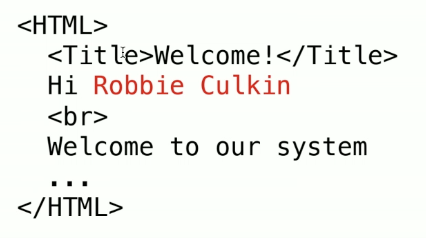
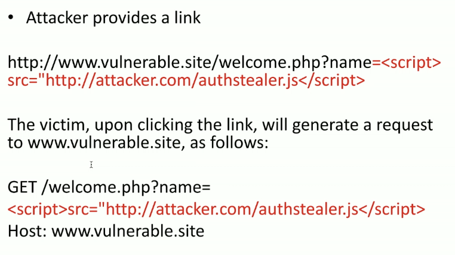

# Web Security and Privacy

## Security

### Potential Security Oversights
- No user authentication
- Allowing weak authentication
- Not sanitizing form entries and requests
- Not encrypting sensitve communications
- Sessions that don't time out
- Out of date (unpatched) software
    - New vulnerabilities discovered all the time
- Bugs that expose user data

### Cross Site Scripting
- The attacker inserts arbitrary HTML on your webpage
    - How can this ever happen?
- What can go wrong
    - Change content of the page
    - Steal user's information

- What if the HTML includes script tags?
    - Replace the page with a new one
        - Fake instance of a page to get passwords, accounts, etc.
    - Pass information from the page to foreign page
        - Cookies, passwords, credit card numbers, session ids
    - Download user's cookies (passwords) for other sites

### Cross Site Scripting: How
Request:

Get/welcome.php?name=Robbie%20Culkin
Host: www.vulnerable.site

Response:

### Cross Site Scripting: Mitgation 
- Don't allow any HTML to be inserted
    - Backend libraries to strip out HTML tags
- Don't allow malicious HTML to be inserted
    -  Backend libraries to scirpt out the HTML tags
        - Limited set of allowed tags for formatting
- Similar techniques  may be used to protect against SQL inject

### Distributed Denial of Service
- DDos
- Overwhelm a server with malicious requests to block regular users
- Requests don't come from one machine
    - These are easily blocked
- Attackers use a number of controlled machines, often comprised
    - Hard to spot

### DDos Mitigation
- Rate limiting
    - Limit volume of requests from a user
- Throw out excess traffic at random
    - Some will be malicious, some will be legitimate
- Distribute traffic across network
    - By distributing load, can accommodate huge volume

### Netowrk Security
- Need to send requests: GET/POST
- Need to send responses: HTML Documents
- Network channels aren't necessarily secure
- Confidentiality: What if someone intercepts and reads this message?
- Integrity: What if someone intercepts and alters this message?

### Secure Communication
- For anyone other than the intended recipient,  we want our messages to be:
    - Unreadable
    - Impossible to change without detection
- Encryption function
    - F(X) = Y easy to compute
    - F^-1(Y) = X difficult to compute (without additional knowledge)

### Encryption and Decryption

- Encryption
    – Ensures privacy within an organization and on the Internet
    – The conversion of data into an unreadable form called ciphertext

- Decryption
    – The process of converting the ciphertext back into its original form, called plaintext or cleartext, so it can be understood.
    - The encryption/decryption process requires an algorithm and a key.

## Privacy 
Privacy Policy

• Statement saying what the web site does with
any information it collects
– Or otherwise obtains from the user
– And why the web site needs this information
• Generally considered legally binding
– Must obey the laws of the land
– Different lands have different laws
• Written in dense legal language
• Users may or may not pay attention

The Role of a Privacy Policy

• Delineate what types of information are collected
– Whether that information is used immediately or
saved

• Specify why the information is needed
– Not always done
– Useful if the application is not obvious
• Specify who owns the information
– If you own your information, company can’t use it
freely
– If they own the information things are more flexible

Specify what an application can do with the
information
– Use in the application only
– Use in the application and the owning company
– Use in the application, owning company, affiliates
– Share (sell to) with related businesses
– Share (sell to) with anyone
• Specify which controls you have over the information
– Can you stop it from being collected
– Can you request any collected information be discarded